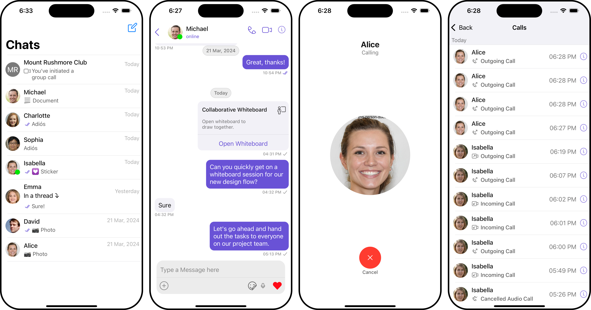

<p align="center">
  
</p>

# iOS Sample App with APNs Push Notifications by CometChat

The CometChat iOS [Enhanced Push Notifications (Beta)](https://www.cometchat.com/docs-beta/notifications/push-overview) Sample App is capable of handling push notifications for one-on-one (private), group messaging, and even call notifications. This sample app enables users to send and receive text messages, make and receive calls, and effectively displays push notifications for these interactions.

<div style="
    display: flex;
    align-items: center;
    justify-content: center;">
   
</div>


## Pre-requisite

1. Login to the [CometChat Dashboard](https://app.cometchat.com/).
2. Select an existing app or create a new one.
3. Click on the Notifications section from the menu on the left.
4. Enable Push Notifications by clicking on the toggle bar and configure the push notifications.
5. Add credentials for APNs.
6. Make a note of the Provider ID.

## Run the Sample App

1. Clone this repository.
2. Install the dependencies.

```
pod install
```

3. Add your app credentials like `appId`, `region`, and `authKey` in the `AppConstants.swift` file. Keep the value of `notificationMode` as `APNs` (Recommended for iOS).
4. Follow our [APNs integration](https://www.cometchat.com/docs/notifications/push-integration#add-apns-credentials) guide.
5. Add the Provider ID for registering the APNS and VoIP tokens in `PROVIDER_ID` in [AppConstants.swift](SampleAppPushNotificationAPNs/AppConstants.swift) file:

6. Run the sample app.


## Help and Support

For issues running the project or integrating with our UI Kits, consult our [documentation](https://www.cometchat.com/docs/notifications/push-overview) or create a [support ticket](https://help.cometchat.com/hc/en-us) or seek real-time support via the [CometChat Dashboard](https://app.cometchat.com/).
